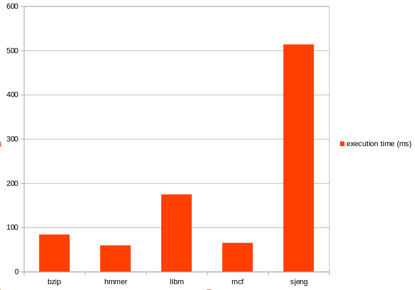
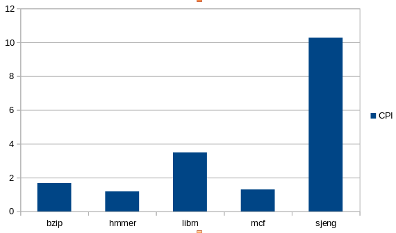
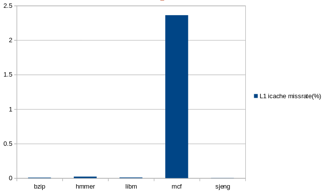
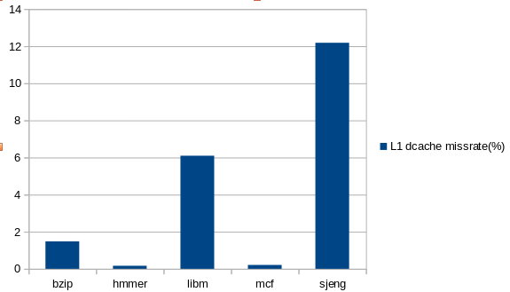
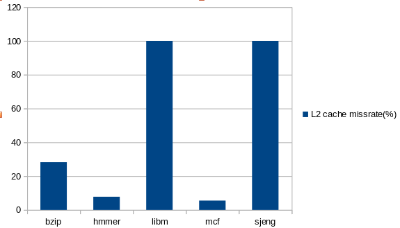
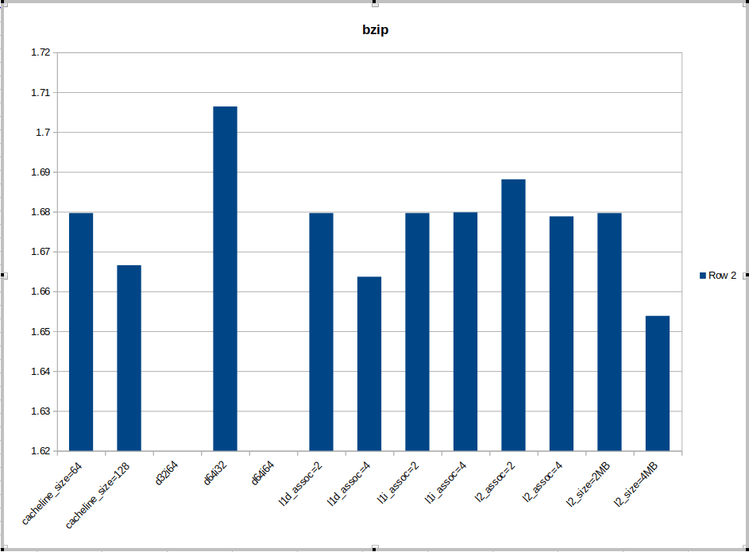
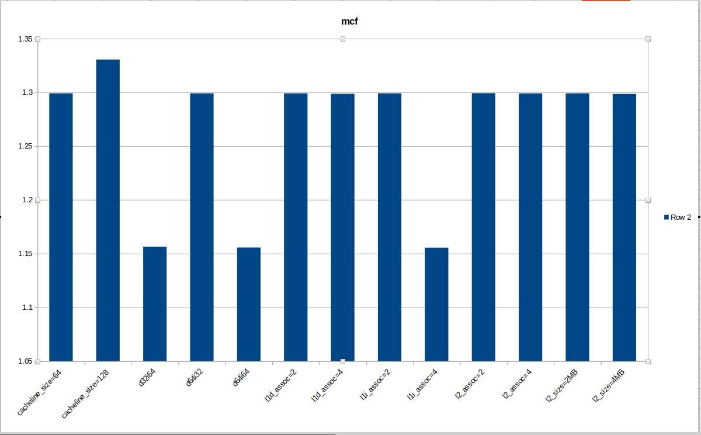
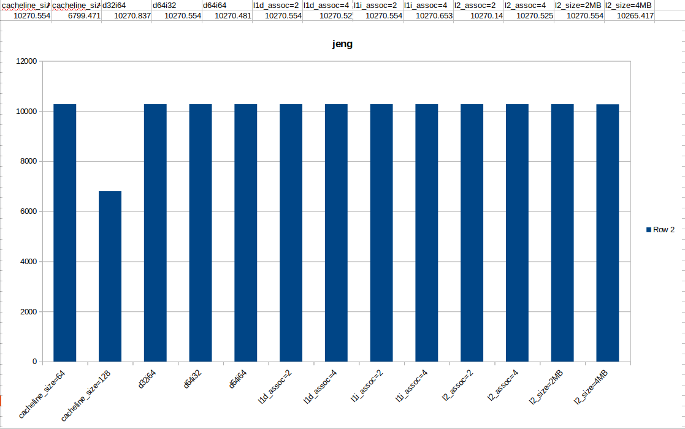
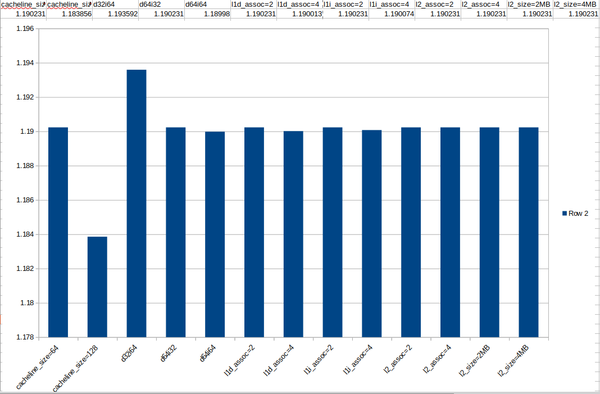

# LAB_02 REPORT - Design Space Exploration με τον gem5 

<h2> 01. SPEC CPU2006 Benchmarks στον gem5 </h2>

[system.cpu.dcache] L1 Data cache: 

    size=65536           # 64KB size 
    assoc=2              # 2-way-associative
    
[system.cpu.icache] L1 Instruction cache:

    size=32768           # 32KB size
    assoc=2              # 2-way-associative

[system.l2] L2 cache:

    size=2097152         # 2MB size
    assoc=8              # 8-way-associative   

[system] cache line size:

    cache_line_size=64   # 64B

  
<h2> Αποτελέσματα benchmarking (default values) </h2>

| | param |  bzip      | hmmer | libm | mcf | sjeng |
| ----------- | ----------- | ----------- | ----------- | ----------- | ----------- | ----------- |
| execution time (ms) | sim_seconds      | 83.982       | 59.396 | 174.671 | 64.955 | 513.528 | 
| CPI | system.cpu.cpi   | 1.6797        | 1.1879 | 3.4934 | 1.2991	 | 10.2706 |
| L1 icache missrate(%) | icache.overall_miss_rate   | 0.0077       | 0.0221 | 0.0094 | 2.3612 | 0.0020 |
| L1 dcache missrate(%)	 | dcache.overall_miss_rate     | 1.4798       | 0.1637 | 6.0972 | 0.2108 | 12.1831 |
| L2 cache missrate(%) | l2.overall_miss_rate::total      | 28.2163       | 7.7760 | 99.9944 | 5.5046 | 99.9972 |
 
<h3> PLOTS </h3>
 

Execution Time

CPI

L1 icache missrate

L1 dcache missrate

L2 cache missrate

<h2> Αποτελέσματα benchmarking (ρολόι 1GHz/3GHz και αποκρίσεις) </h2>
<!-- 
| | bzip      | hmmer | libm | mcf | sjeng |
| ----------- | ----------- | ----------- | ----------- | ----------- | ----------- |
| 1GHz(ms) | 161.025 | 118.530 | 262.327 | 127.942 | 704.056 |
| 3GHz(ms) | 58.385 | 39.646 | 146.433 | 43.867 | 449.821 |
   -->
 

cpu_cluster.clk_domain.clock (ΔΕ ΒΡΗΚΑ ΕΝΤΟΛΗ) 

<h3>Χρονισμοί Ρολογιών Συστήματος και CPU Συστήματος</h3>
default:

    system.clk_domain.clock               1000       # Clock period in ticks | System Clock
    system.cpu_clk_domain.clock           500        # Clock period in ticks | CPU Clock

1GHz:

    system.clk_domain.clock               1000       # Clock period in ticks | System Clock
    system.cpu_clk_domain.clock           1000       # Clock period in ticks | CPU Clock

3GHz:

    system.clk_domain.clock               1000       # Clock period in ticks | System Clock
    system.cpu_clk_domain.clock           333        # Clock period in ticks | CPU Clock

Παρατηρούμε ότι όταν δίνεται μια νέα συχνότητα στη γραμμή εντολών, το νέο ρολόι της CPU του συστήματος προσδιορίζεται διαιρώντας το ρολόι του συστήματος με τη νέα συχνότητα. Συμπεραίνουμε ότι όταν αλλάζει η συχνότητα [1GHz/3GHz] επηρεάζεται μόνο το ρολόι της cpu του συστήματος (cpu clock), ενώ το ρολόι του συστήματος (system clock) παραμένει το ίδιο. Αυτό συμβαίνει γιατί το ρολόι της cpu χρησιμοποιείται μόνο για τον επεξεργαστή ενώ το ρολόι του συστήματος αφορά σε όλα τα στοιχεία του υπολογιστικού συστήματος.   

Προσθέτοντας άλλον ένα επεργαστή  που έχει διαφορετικό ρολόι από το υπόλοιπο σύστημα θα παρατηρούσαμε αλλαγή επίσης στο cpu clock αλλά ίδιο system clock στα 1GHz. Επηρεάζεται δηλαδή από τη συχνότητα.

Δεν υπάρχει ακριβής αναλογία μείωσης του χρόνου εκτέλεσης με την αύξηση της συχνότητας. 
  

<h2> Αλλαγή της DDR3 με πιό γρήγορο clock (1600/2133MHz) </h2>
  
  
//TODO

<h2>02. Design Exploration – Βελτιστοποίηση απόδοσης  </h2>

Εκτελέσαμε 13 simulations για τα 5 διαφορετικά benchmarks (bzip,hmmer,lib,mcf,sjeng)

Τροποποιήσαμε τις τιμές:

- L1 instruction cache size 
- L1 instruction cache associativity
- L1 data cache size 
- L1 data cache associativity 
- L2 cache size 
- L2 cache associativity 
- Μέγεθος cache line 

L1 [i,d] instruction cache size:

    --l1d_size=32kB--l1i_size=64kB
    --l1d_size=64kB--l1i_size=32kB
    --l1d_size=64kB--l1i_size=64kB

L2 cache size:

    --l2_size=2MB    
    --l2_size=4MB

Associativity L1[instruction, data], L2

    --l1i_assoc=2            
    --l1i_assoc=4           
    --l1d_assoc=2            
    --l1d_assoc=4            
    --l2_assoc=2
    --l2_assoc=4

Size of cache line:

    --cacheline_size=64      
    --cacheline_size=128     

<h3> PLOTS </h3>

- Ως μέγιστη απόδοση θεωρούμε το μικρότερο CPI

 spec_bzip

spec_mcf

spec_jeng

spec_hmmer

  

<h2>03. Βελτιστοποίηση κόστους/απόδοσης </h2>

Θεωρούμε τις l1 l2 είναι κατασκευασμένες από SRAM, με την l1 να είναι βελτιστοποιημένη ως προς την καθυστέρηση και την l2 ως προς το μέγεθος, καταλήγουμε στο ότι η l1 έχει σημαντικά μεγαλύτερο κόστος ανα MB. 
Έστω το κόστος τις l1 32kΒ να ισούται με το κόστος του 1MB l2, το οποίο το ορίζω στην 1 μονάδα κόστους. Η σχέση κόστους που συνδέει τις δύο μνήμες είναι γραμμική.
Έχουμε, λοιπόν, το κόστος για μέγεθος x τις κάθε μνήμης l1 l2 να κοστίζει,
 costL1 = x/32kB μ.κ.
 costL2 = x/1MB μ.κ.

Το associativity όταν διπλασιάζεται, αυξάνεται και η πολυπλοκότητα και το μέγεθος των ηλεκτρονικών κυκλωμάτων που πρέπει να χρησιμοποιηθούν άρα αυξάνει αρκετά ,αλλά δε διπλασιάζει το συνολικό κόστος. 
Εστω ότι ότι 2*assoc => 1.5*cost
τότε:
costL1 = 1.5^log2(assoc/2) μ.κ. 
costL2 = 1.5^log2(assoc/8) μ.κ. 

Τέλος η αλλάγη του cache-line size δεν επηρεάζει σημαντικά το κόστος, καθώς αν διπλασιάσουμε το συνολικό μέγεθος της cache θα έχει απο τη μία τον διπλασιασμό του buffer (αύξηση κόστους), από την άλλη όμως θα μειώνεται και το μέγεθος του tag κατά ένα bit και απλοποιείται το μέγεθος και η πολυπλοκότητα των κυκλωμάτων (μείωση κόστους).

Από τα παραπάνω καταλήγουμε στον τύπο κόστους:
cost = (2*1.5^log2(assoc/2) *  l1isize/32kB +  l1dsize/32kB + 1.5^log2(assoc/8) *  l2size/1MB)/CPI

<h2> Κριτική εργασίας </h2>
Η εργασία μας έκανε να εξοικειωθούμε περισσότερο με τις παραμέτρους των επεξεργαστών (cache, assoc etc) καθώς τρέχοντας διαφορετικά benchmark με διαφορετικές παραμέτρους παρατηρούσαμε τις εκάστοτε διαφορές. Έχοντας τρέξει όλες τις προσομοιώσεις με το χέρι, καταλάβαμε, αν και καθυστερημένα, την αξία του bash script καθώς θα είχαμε γλυτώσει σημαντικά περισσότερο χρόνο. Τέλος, να αναφέρουμε ότι οι δικές μας προσομοιώσεις ήθελαν μικρές αλλάγες στα έτοιμα σκριπτάκια που δίνονταν προκειμένου να τρέξει σωστά (όπως νομίζαμε εμείς 😛).