# LAB_03 REPORT - Energy-Delay-Area Product Optimization (gem5 + McPAT)

# Ερώτημα 1
## 1.1 

Dynamic power: η κατανάλωση ενέργειας που προκύπτει από τη δραστηριότητα των τρανζίστορ της CPU, και οφείλεται στη φόρτιση και αποφόρτιση των πυκνωτών εντός τους.  
Ισχύει η σχέση: Pdyn = C*V^2*f,
όπου V είναι η τάση λειτουργίας, f η συχνότητα του ρολογιού, και C η συνολική χωρητικότητα. 
 
Leakage: η κατανάλωση ενέργειας που οφείλεται στη διαρροή ρεύματος εντός των transistor, λόγω του γεγονότος ότι δεν έχουν τέλειες επαφές. Το μέγεθος αυτής της κατανάλωσης εξαρτάται από τα γεωμετρικά χαρακτηριστικά των transistor, τις φυσικές τους ιδιότητες και την θερμοκρασία τους. Η γενική τάση είναι ότι το leakage αυξάνεται για μικρότερα transistors και υψηλότερες θερμοκρασίες. 

Αν δεν χρησιμοποιηθούν τεχνικές gating και dynamic frequency scaling, το dynamic power δεν επηρεάζεται από το είδος του προγράμματος που τρέχει, καθώς όλες οι παράμετροι που το επηρεάζουν μένουν σταθερές. Αν χρησιμοποιηθούν τα παραπάνω, το dynamic power εξαρτάται από τη δομή του προγράμματος και το ενδεχόμενο χρήσης πολλαπλών πυρήνων.  Όσον αφορά το leakage, η κύρια παράμετρος που μπορεί να μεταβληθεί και να το επηρεάσει είναι η θερμοκρασία. Άρα για όσο περισσότερο χρόνο τρέχει ένα πρόγραμμα, τόσο ανεβαίνει η θερμοκρασία και άρα τόσο αυξάνεται το leakage.  

## 1.2

Για να διευκρινίσουμε την διάρκεια μπαταρίας για την εκτέλεση ενός προγράμματος δεν αρκεί να γνωρίζουμε την ισχύ των επεξεργαστών καθώς εάν έχουν διαφορετική απόδοση (χρονική) στην εκτέλεση του προγράμματος θα μπορούσε ο επεξεργαστής που καταναλώνει περισσότερη ισχύ να καταναλώνει συνολικά λιγότερη ενέργεια. Δεν υπάρχει τρόπος να γνωρίζουμε πλήρως μόνο με τα δεδομένα του McPAT. Χρειαζόμαστε τον χρόνο εκτέλεσης του προγράμματος, δηλαδή δεδομένα από έναν προσομοιωτή όπως ο gem5.

## 1.3

Τα αποτελέσματα που προκύπτουν από την εκτέλεση του McPAT φαίνονται στον ακόλουθο πίνακα:
<table>
     <thead>
        <tr >
            <th > </th>
            <th >Xeon</th>
            <th >ARM A9</th>
        </tr>
    </thead>
    <tbody>
        <tr >
            <td >Total Leakage</td>
            <td >36.83 W</td>
            <td >0.109 W</td>
        </tr>
        <tr>
            <td >Runtime Dynamic</td>
            <td >72.91 W</td>
            <td >2.960 W</td>
        </tr>

   </tbody>
</table>

Ορίζοντας Δt το χρονικό διάστημα το οποίο απαιτείται για την εκτέλεση κάποιας εφαρμογής στον Xeon και με δεδομένο ότι ο ARM A9 χρειάζεται 40 φορές περισσότερο χρόνο για το πέρας της. Εξετάζωντας τις απώλειες στο πέρας της εφαρμογής για τον ARM A9 προκύπτει:

Εxeon = Pdyn_Xeon*Δt + Pleak_Xeon*50*Δt = 1932.6375*Δt
Εa9 = Pdyn_A9*50*Δt + Pleak_A9 *50*Δt;= 9.52*Δt

Παρατηρούμε μία πολύ μεγάλη διαφορά η οποία οφείλεται στο γεγονός ότι το Pleak_Xeon συνεχίζει να υπάρχει ακόμα και μετά το πέρας εκτέλεσης της εφαρμογής, αφού θεωρούμε δεδομένο από την εκφώνηση πως δεν διακόπτεται η λειτουργία του συστήματος μετά την ολοκλήρωση εκτέλεσης. Συμπεραίνουμε, λοιπόν, πως ο Xeon δεν μπορεί να είναι περισσότερο energy-efficient από τον ARM A9, παρά την διαφορά στην απόδοση.

# Ερώτημα 2

Πληροφορίες για το delay - energy

Το delay είναι ο χρόνος εκτέλεσης του προγράμματος και θα το βρούμε από τα στατιστικά του gem5: στο αρχείο stats.txt το sim_seconds.
Το energy υπολογίζεται ως εξής : energy = (leakage + Runtime dynamic) * time
Χρησιμοποιούμε το script print_energy.py που δόθηκε, τροποποιημένο ,για να αυτοματοποιήσουμε τη διαδικασία.
Μέτρηση EDAP στα προηγούμενα benchmarks - επιλογή βέλτιστων προδιαγραφών

Επειδή το EDAP είναι πολυ διαφορετικό για τα benchmarks βοηθάει οπτικά αυτή τη φορά να παρουσιαστεί κάθε benchmark σε δικό του γράφημα.
Με μωβ είναι η default τιμή και με κίτρινο η τιμή με την εκάστοτε παράμετρο αλλαγμένη για εύκολη σύγκριση. Όλες οι μετρήσεις στο αρχείο data.csv

Στα ακόλουθα γραφήματα παρουσιάζεται η μεταβολή της συνολικής ενέργειας, καθώς και της μέγιστης ισχύς, σε σχέση με κάθε παράμετρο του υποσυστήματος μνήμης. Η συνολική ενέργεια υπολογίζεται ως:

TotalPower = RuntimeDynamic + SubthresholdLeakage + GateLeakage

Peak Power             |  Total Power
:-------------------------:|:-------------------------:
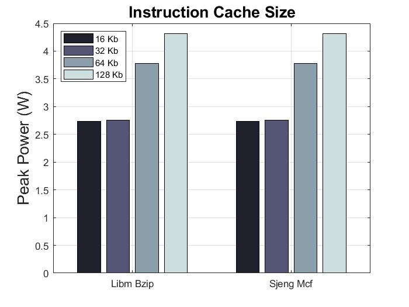 |  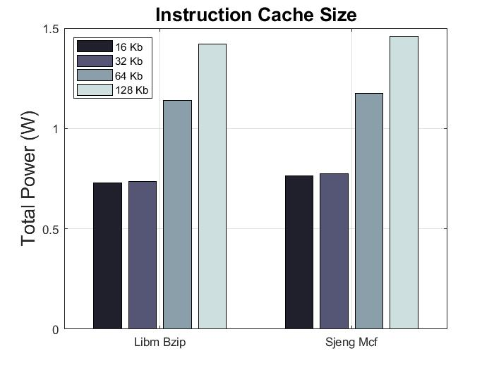

Peak Power             |  Total Power
:-------------------------:|:-------------------------:
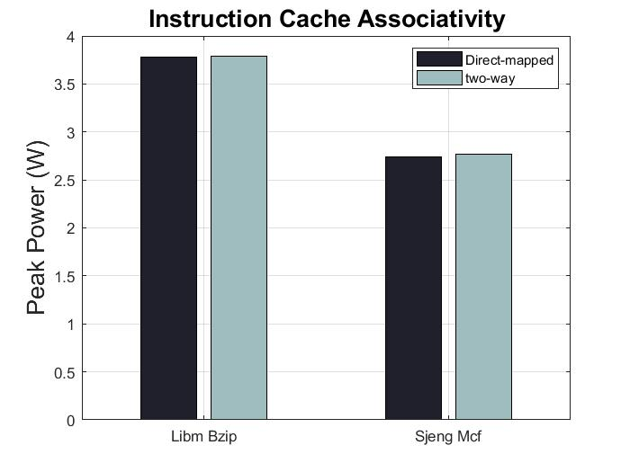 |  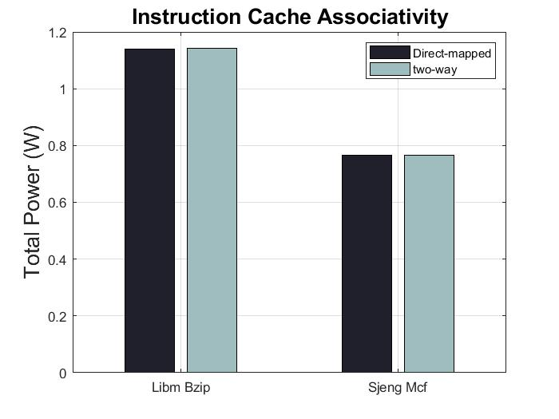

Peak Power             |  Total Power
:-------------------------:|:-------------------------:
!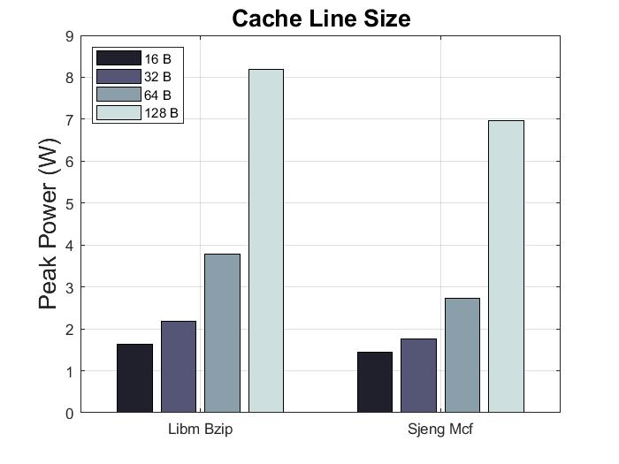 |  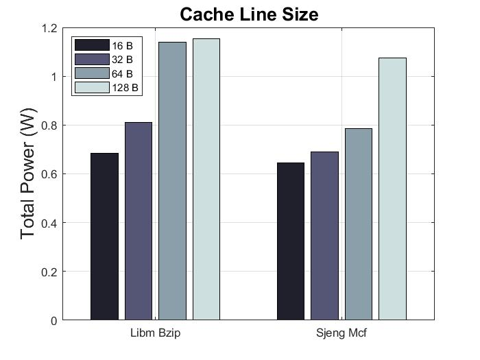

Peak Power             |  Total Power
:-------------------------:|:-------------------------:
 |  

Peak Power             |  Total Power
:-------------------------:|:-------------------------:
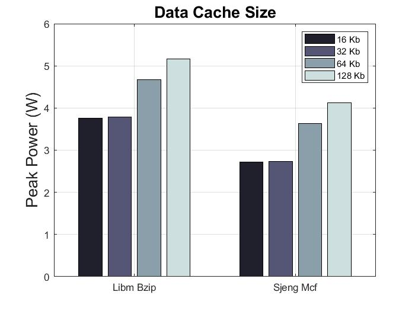 |  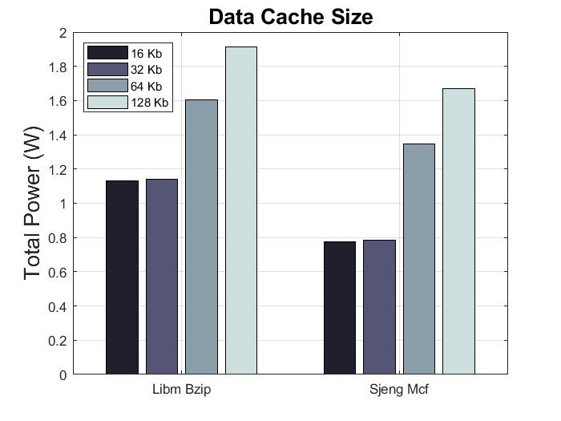

Peak Power             |  Total Power
:-------------------------:|:-------------------------:
 |  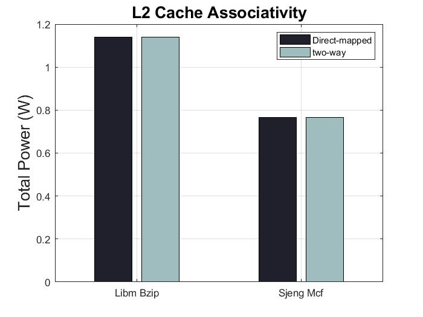

Peak Power             |  Total Power
:-------------------------:|:-------------------------:
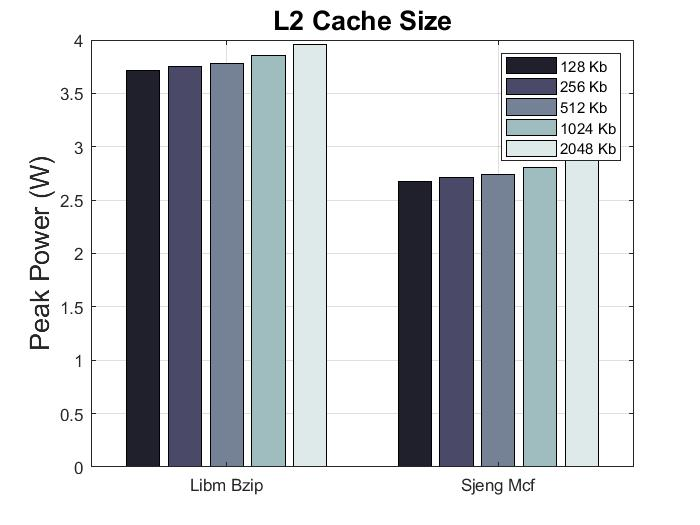 |  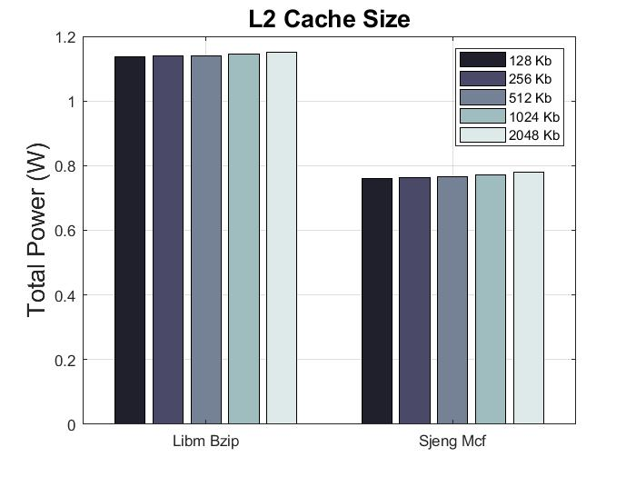

### Energy-Delay Product
Στο παρακάτω διάγραμμα παρατηρούμαι την μεταβολή του EDP σε σχέση με κάθε χαρακτηριστικό του υποσυστήματος μνήμης για το bechmark sjeng.

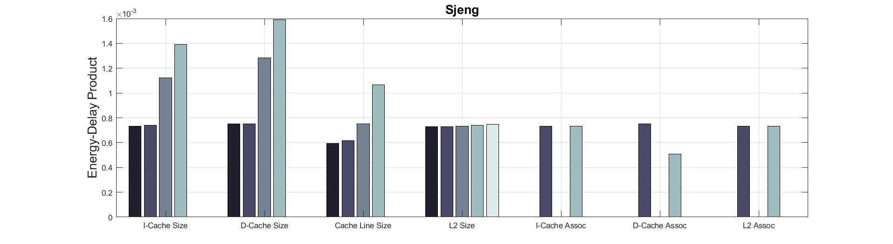

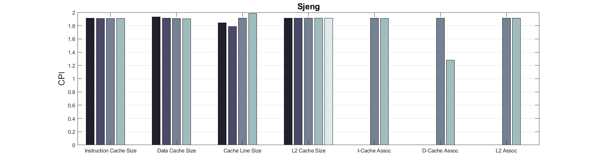

Παραθέτουμε για σύγκριση και την μεταβολή του CPI για το sjeng, καθώς υπάρχει αναλογική σχέση ανάμεσα σε αυτό και τον χρόνο εκτέλεσης.

*CPUtime = InstructionsNumber&#8901;CPI&#8901;ClockCycleTime*

Παρατηρώντας τα παραπάνω διαγράμματα με σκοπό την επίτευξη του ελάχιστου EDP επιλέγουμε τα ακόλουθα:
| Μέγεθος I-Cache | Μέγεθος D-Cache | Μέγεθος L2 | Μέγεθος Cache Line |  I-Cache Assoc | D-Cache Assoc |    L2 Assoc    |
|:---------------:|:---------------:|:----------:|:------------------:|:--------------:|:-------------:|:--------------:|
|      16 Kb      |      16 Kb      |   128 Kb   |        16 B        | Direct-mapped |    Two-way    | Direct-mapped |

και παίρνουμε τελικά τα ακόλουθα αποτελέσματα:
| Χρόνος εκτέλεσης |    CPI   | Peak Power | Total Power |            EDP             |
|:----------------:|:--------:|:----------:|:-----------:|:--------------------------:|
|   0.000776 sec   | 1.551759 |  1.40187 W |   0.6734 W  | 5.22*10^-4 |

## Πηγές πιθανών σφαλμάτων

Οι προβλέψεις του McPAT πιθανώς να περιέχουν σημαντικό σφάλμα λόγω ελλειπούς μοντελοποίησης, μοντελοποίησης πολύ υψηλού επιπέδου ή λόγω υποθέσεων για την υλοποίηση του επεξεργαστή, οι οποίες δε συνάδουν με το μοντέλο που προσομοιώνεται. Πιο συγκεκριμένα, το μοντέλο ισχύος του McPAT είναι αναλυτικό, όχι εμπειρικό, και άρα αγνοεί λεπτομέρειες της υλοποίησης για χάρη της ευελιξίας και της ταχύτητας. Ορισμένα παραδείγματα είναι:
1. Δυσκολία μοντελοποίησης της κατανάλωσης ενέργειας που προκύπτει από τη δραστηριότητα των λογικών πυλών
2. Το McPAT μπορεί να μην συμπεριλαμβάνει συγκεκριμένες εντολές του πραγματικού επεξεργαστή. 
3. Το McPAT υποθέτει ότι κάθε εντολή απαιτεί δύο read ports, πράγμα που δεν είναι απαραίτητα αληθές καθώς κάποιες εντολές (immediate) χρειάζονται μόνο έναν καταχωρητή πέρα από το operand.
4. Τέλειο clock-gating and data-gating. 
5. Για μια δομή cache, το McPAT κάποιες φορές διπλασιάζει το εμβαδόν πυριτίου του στοιχείου, χωρίς να να αυξάνει την per access ενέργεια που καταναλώνει.
6. Πιθανώς κάποια προγραμματιστικά λάθη

Η χρήση δύο προγραμμάτων για την προσομοίωση διαφορετικών πτυχών της ίδιας CPU μπορεί να αποτελέσει πηγή σφάλματος, καθώς τα προγράμματα μπορεί να κάνουν αντικρουόμενες υποθέσεις. Ταυτόχρονα υπερδιπλασιάζεται και η πιθανότητα να επηρεάσει την προσομοίωση κάποιο bug.

<h2> Κριτική εργασίας </h2>

Χρονοβόρα εργασία, χρειάστηκε να ψαξουμε τη βιβλιογραφία για τα ερωτήματα.  
Στη συγκεκριμενη εργασια αποφασισουμε να υλοποιησουμε ενα bash-script ετσι ωστε να παρουμε τα αποτελέσματα ευκολα. Η διαδικασία μας εξοικείωσε περαιτερω με τις εντολες στο terminal (😛). 

